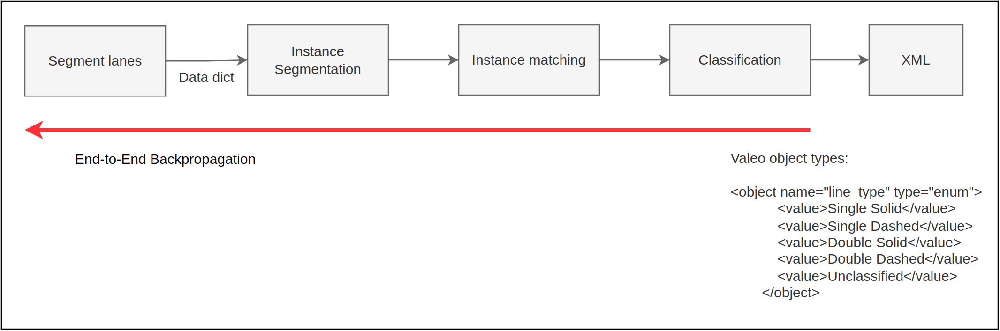

# Lane-extraction

| Person | Module | Extra Tasks | Notes | 
|--------|:------:|------------:|------:|
| Yana   |        |             |       |
| Honza  |        |             |       |
| Ondra  |        |             |       |
| Martin |        |             |       |
| Patrik |        |             |       |

# TBD Tasks
- [ ] Data
- [ ] Module class
- [ ] Visuals
- [ ] Klane dataset

# Segmentation

- Start with one data sequence with labels from Filip (point-wise)
- After loading the data, everything should be in pytorch
- Data loading should have a choice to load fever time-frames
- IoU metric to evaluate the segmentation (codes in the repo)
- Experiment with different hyperparameters (thresholds, points for normal ...) 
- Visualize normals (mayavi is good for this, example in the repo)
- Visualize performance in table (recommend pandas) and graph (matplotlib)

# Instance

- Start with synthetically generated data (in example)
- Try dbscan to get the ids to understand the format
- Look at the lanes_example.py for calculation of KNN in pytorch3d and smoothness loss.
- Run example and compare it in Instance segmentation metric.
- Initialize vectors from points and optimize them in pytorch to match values from PCA eigen vectors
  - points from same id should have the same value
  - optimize only angle as well (useful in future)
  
- Visualize the vectors in the point cloud
- Use real data and try the PCA from dbscan
- Develope loss that respects the shape of lanes (we need to discuss this later)
    - How to split bigger clusters to lanes?
  
# Lane direction vectors

L_NN, L_Smooth

# Workflow
- All in pytorch
- All functions are most likely already done somewhere
  - KNN - pytorch3d
  - metrics - torchmetrics (https://github.com/Lightning-AI/torchmetrics)
  - PCA - torch.svd
  - visualization - matplotlib, mayavi
    
- Compute in 2D after segmentation
- Jupyter (Recommended for developing, then refactor to scripts)
- Github Copilot (one month free trial)
- pre-push (https://git-scm.com/book/en/v2/Customizing-Git-Git-Hooks) or bash script
- coordinated refactor when needed

# Server
- predescribed packages
- ssfhs
- bashrc
- Boruvka
- pytorch3d
- deprecated visuals?
 
# Data on drive 
https://drive.google.com/drive/folders/1urwhi2SGGB3U7t3_JgcvFU1kCCE-ksuS?usp=sharing

# Discord server
https://discord.gg/wa4qwwANK

# brain dump 23.6. Valeo Meeting

- Linearni / nelinearni mod LiDARu (skalovani) - jak dostat?
- Filtrace - podle intenzity a vzdalenosti
- Dataset bez filtrace pro normaly?
- bottleneck je furt ta segmentace
- Ground fit jako mesh sit?
- filter ground by variance in bin? Still with pts above, smoothing
- Vahovat ground plane intensitou, normalou etc. - jedno tema
- RANSAC - residual threshold prvotni filtrovani
- full point cloud je heavy na optimization aproach
- Intra/inter frame matching
- optimalizace vede na object-unique features - mozna neni dobre?
- KPI? - segmentace GT - udelat id, fitting a jak to zpetne zapadne do segmentace?
- metrika na urovni polyline jako hlavni pro projekt
- metrika: navrhnout polylines, ale drzet se modularnich zatim
- Release version - pustit v ramci velke ulohy
