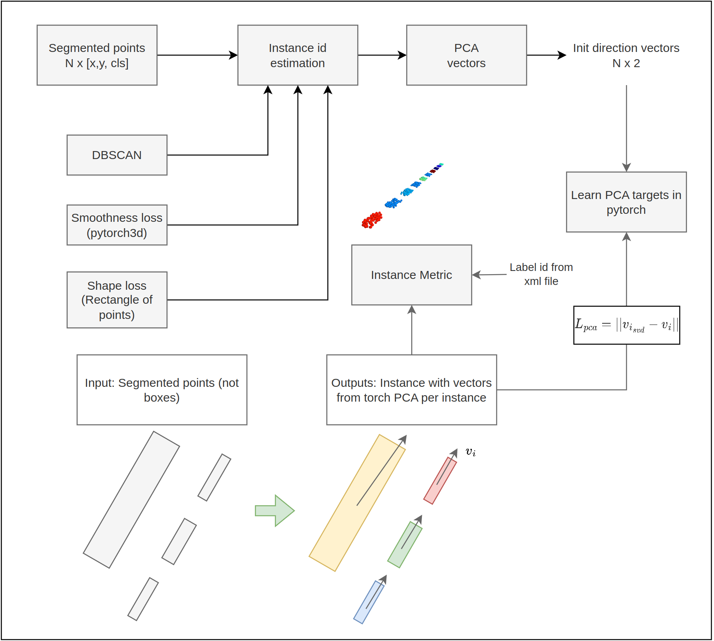

# Lane-extraction

| Person | Module | Tasks | Notes | 
|--------|:------:|------:|------:|
| Yana   |        |       |       |
| Honza  |        |       |       |
| Ondra  |        |       |       |
| Martin |        |       |       |
| Patrik |        |       |       |

# Todo Tasks
- [ ] Data
- [ ] Module class
- [ ] Visuals
- [ ]

# Segmentation

- Start with one data sequence with labels from Filip (point-wise)
- After loading the data, all should be in pytorch
- Data loading should have a choice to load fever time-frames
- IoU metric to evaluate the segmentation (codes in the repo)
- Experiment with different hyperparameters (thresholds, points for normal ...) 
- Visualize normals (mayavi is good for this, example in the repo)
- Visualize performance in table (recommend pandas) and graph (matplotlib)

# Instance

L_PCA
# Lane direction vectors

L_NN, L_Smooth

# Workflow
- All in pytorch
- All functions are most likely already done somewhere
- Compute in 2D after segmentation
- Jupyter (Recommended for developing, then refactor to scripts)
- Github Copilot (one month free trial)
- pre-push (https://git-scm.com/book/en/v2/Customizing-Git-Git-Hooks) or bash script
- coordinated refactor when needed

# Server
- predescribed packages
- ssfhs
- bashrc
- Boruvka
- pytorch3d
- deprecated visuals?
 

# Discord server
https://discord.gg/wa4qwwANK
