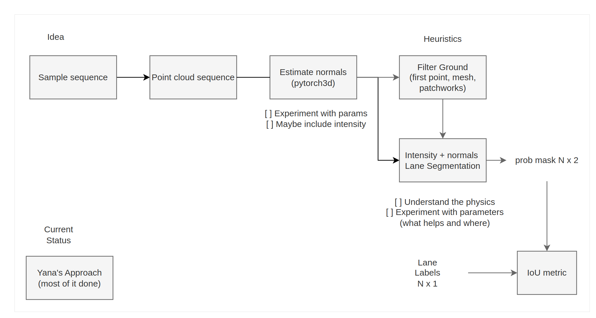
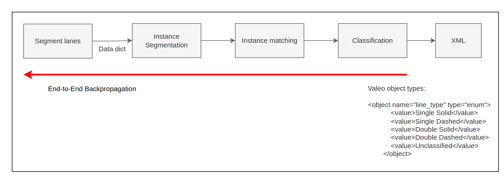

# Lane-extraction

| Person |            Module            | Other Tasks | Notes | 
|--------|:----------------------------:|------------:|------:|
| Yana   | Segmentation, Init Framework |             |       |
| Honza  |           Instance           |             |       |
| Ondra  |             TBD              |             |       |
| Martin |      Instance Matching       |             |       |
| Patrik |        Full Pipeline         |             |       |

# TBD Tasks
- [ ] Data
- [ ] Module class
- [ ] Visuals
- [ ] Klane dataset
- [ ] Non-linear least square instead of optimizer

# Starters
- If you are not familiar with pytorch, go over these tutorials:
  - It covers the basics of optimization with pytorch, that is what we will use
  - Try it in Jupyter notebooks (it is really the most efficient way of scripting for data science)
  - [Tensors](https://pytorch.org/tutorials/beginner/basics/tensorqs_tutorial.html)
  - [Autograd](https://pytorch.org/tutorials/beginner/basics/autogradqs_tutorial.html)
  - [Training](https://pytorch.org/tutorials/beginner/basics/optimization_tutorial.html)
  - [Pytorch modules](https://pytorch.org/tutorials/beginner/nn_tutorial.html)

# Workflow
- We will estabilish this on the fly
- When some work might be usefull to others, push it to repo in **common** package and let know on discord
- All in pytorch, vectorized operations
- All functions are most likely already done somewhere
  - KNN - pytorch3d
  - metrics - torchmetrics (https://github.com/Lightning-AI/torchmetrics)
  - PCA - torch.svd
  - visualization - matplotlib, mayavi
    
- Compute in 2D after segmentation
- Jupyter (Recommended for development, then automatically export to scripts)
- Github Copilot (one month free trial)
- Coordinated refactor when needed
- Release version branch when outputs works end-to-end 

[//]: # (- Pre-push &#40;https://git-scm.com/book/en/v2/Customizing-Git-Git-Hooks&#41; or bash script)

# GPU Server
- Address: username@boruvka.felk.cvut.cz
- Should have enough shared gpu cards
  - **pyconfig** file is used for python environment on server as well as remote interpreter
  - It should have everything included (torch, pytorch3d, torchmetrics, matplotlib, pandas, sklearn, scipy, numpy, jupyter, ...)
    - if not, search via command "module spider package_name"
  - Tunnel does not work for me, I set up the **sshfs** to see files from local computer and visualize in local
  - Highly recommend estabilishing remote interpreter for bigger computations than toy examples 
  - **~/.bashrc** is sourced everytime you connect through ssh, you can add aliases there or some convinient commands
  - I have a script for "remote" and fluent point cloud visualization using pptk library, We will discuss that when you have problems with visuals from the server 
 
# Data on drive 
- Let me know if access is needed
- Discuss between each other how to structure data for the project to fit your workflow
- Data: https://drive.google.com/drive/folders/1urwhi2SGGB3U7t3_JgcvFU1kCCE-ksuS?usp=sharing

# Discord server
- Link to discord: https://discord.gg/wa4qwwANK
 

# Segmentation

- [ ] Start with one data sequence with labels from Filip (point-wise)
- [ ] After loading the data, everything should be in pytorch
- [ ] Data loading should have a choice to load fever time-frames
- [ ] IoU metric to evaluate the segmentation (codes in the repo)
- [ ] Experiment with different hyperparameters (thresholds, points for normal ...) 
- [ ] Visualize normals (mayavi is good for this, example in the repo)
- [ ] Visualize performance in table (recommend pandas) and graph (matplotlib)

# Instance

- [ ] Start with synthetically generated data (in example)
- [ ] Try dbscan to get the ids to understand the format
- [ ] Look at the lanes_example.py for calculation of KNN in pytorch3d and smoothness loss.
- [ ] Run example and compare it in Instance segmentation metric.
- [ ] Initialize vectors from points and optimize them in pytorch to match values from PCA eigen vectors
  - [ ] points from same id should have the same value
  - [ ] optimize only angle as well (useful in future)
  
- [ ] Visualize the vectors in the point cloud
- [ ] Use real data and try the PCA from dbscan
- [ ] Develope loss that respects the shape of lanes (we need to discuss this later)
    - [ ] How to split bigger clusters to lanes?
  
# Lane direction vectors

- [ ] Generate toy samples of instance centers (matplotlib ginput for example)
- [ ] Assign vector field to the points represented as torch tensors Idx x [vx,vy]
- [ ] Use pytorch3d Nearest neighboor function to calculate chamfer distance (L_CD) between instance and closest instance to its vector
- [ ] Optimize the vectors to minimize the chamfer distance and visualize output
- [ ] Add smoothness loss (L_smooth) to make connected instance similar (the loss after that will converge but not to zero with both losses)
- [ ] Make animation of the optimization at each iteration
- [ ] Use output from real data instances
- [ ] Add pca loss from instance module to the solution

# Full pipeline so far

# brain dump 23.6. Valeo Meeting

- Linearni / nelinearni mod LiDARu (skalovani) - jak dostat?
- Filtrace - podle intenzity a vzdalenosti
- Dataset bez filtrace pro normaly?
- bottleneck je furt ta segmentace
- Ground fit jako mesh sit?
- filter ground by variance in bin? Still with pts above, smoothing
- Vahovat ground plane intensitou, normalou etc. - jedno tema
- RANSAC - residual threshold prvotni filtrovani
- full point cloud je heavy na optimization aproach
- Intra/inter frame matching
- optimalizace vede na object-unique features - mozna neni dobre?
- KPI? - segmentace GT - udelat id, fitting a jak to zpetne zapadne do segmentace?
- metrika na urovni polyline jako hlavni pro projekt
- metrika: navrhnout polylines, ale drzet se modularnich zatim
- Release version - pustit v ramci velke ulohy
